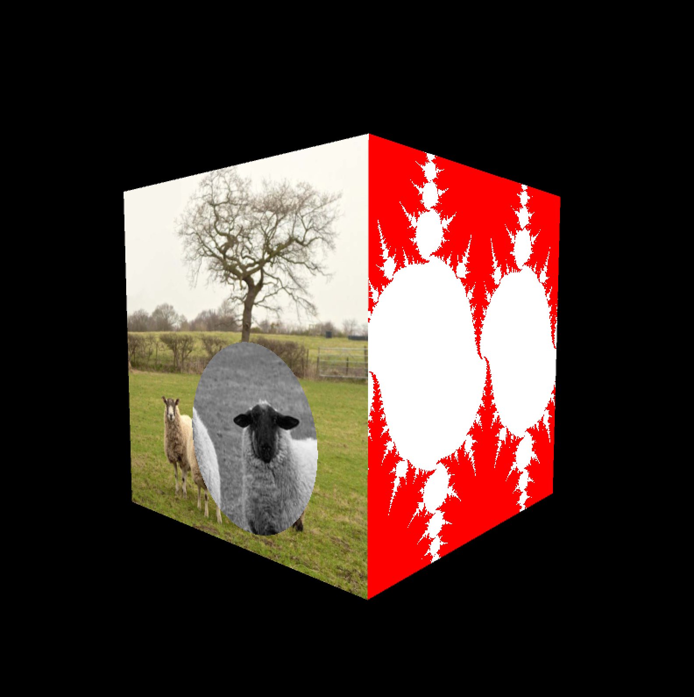
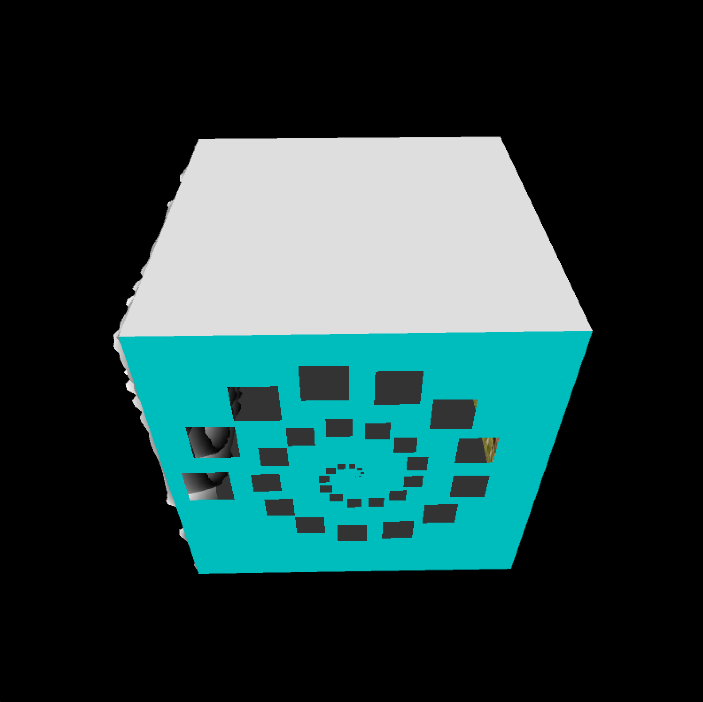
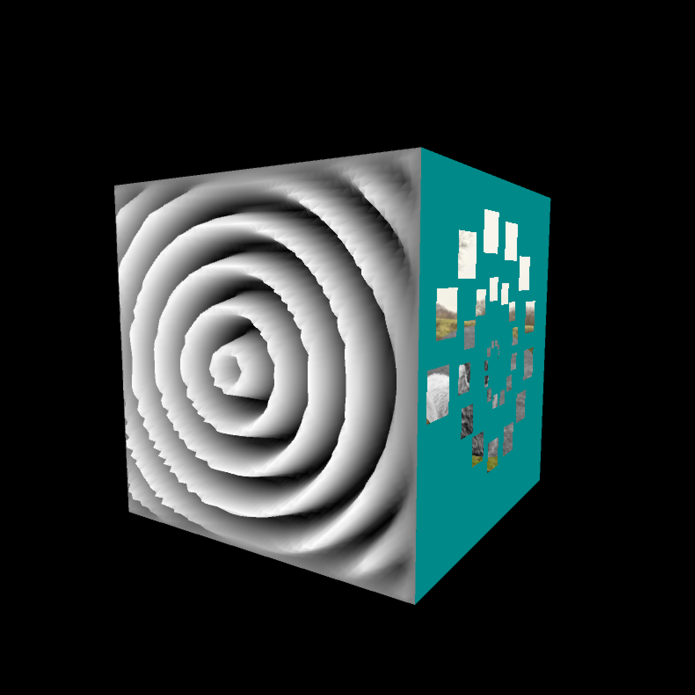
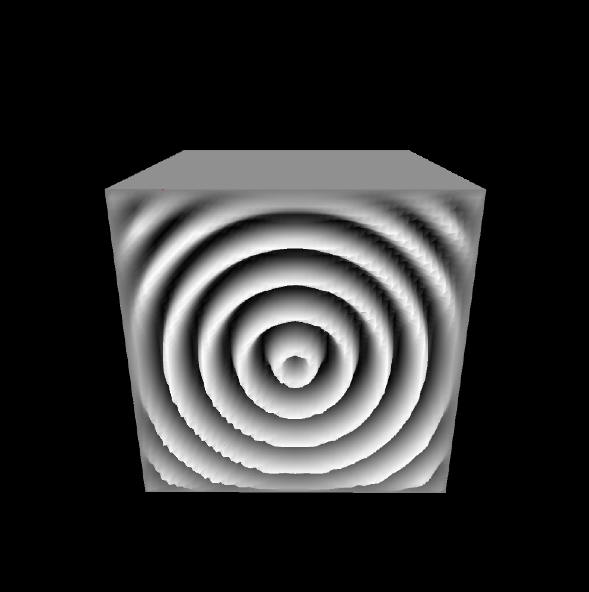
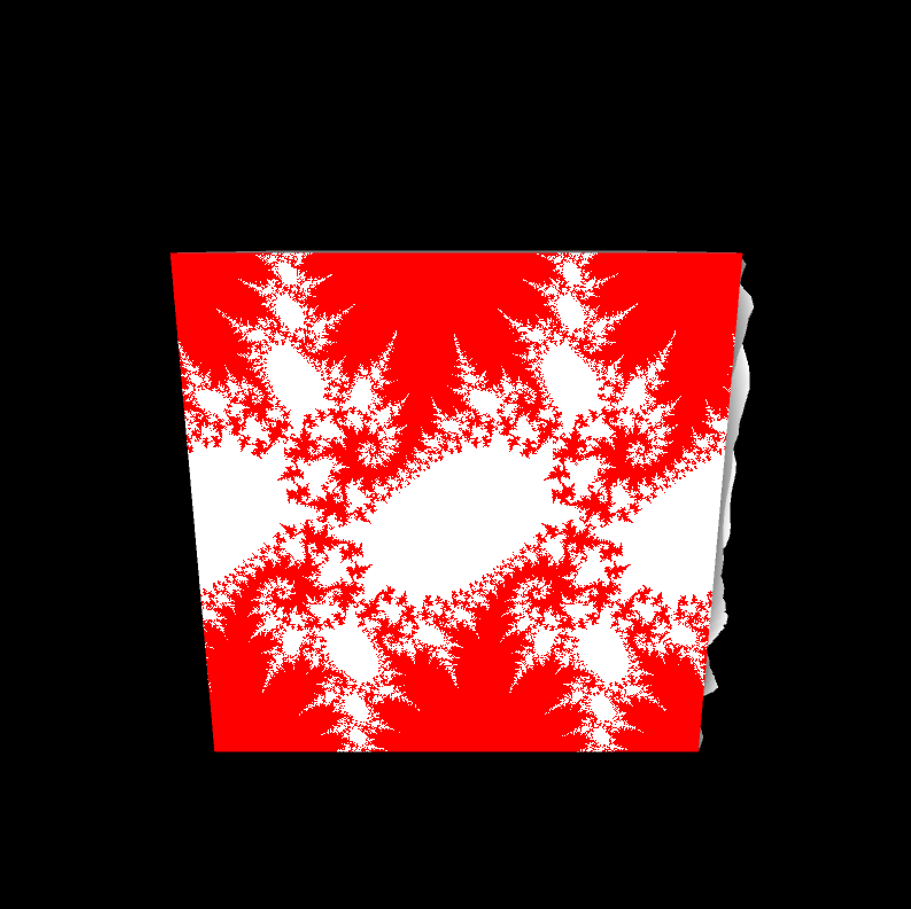
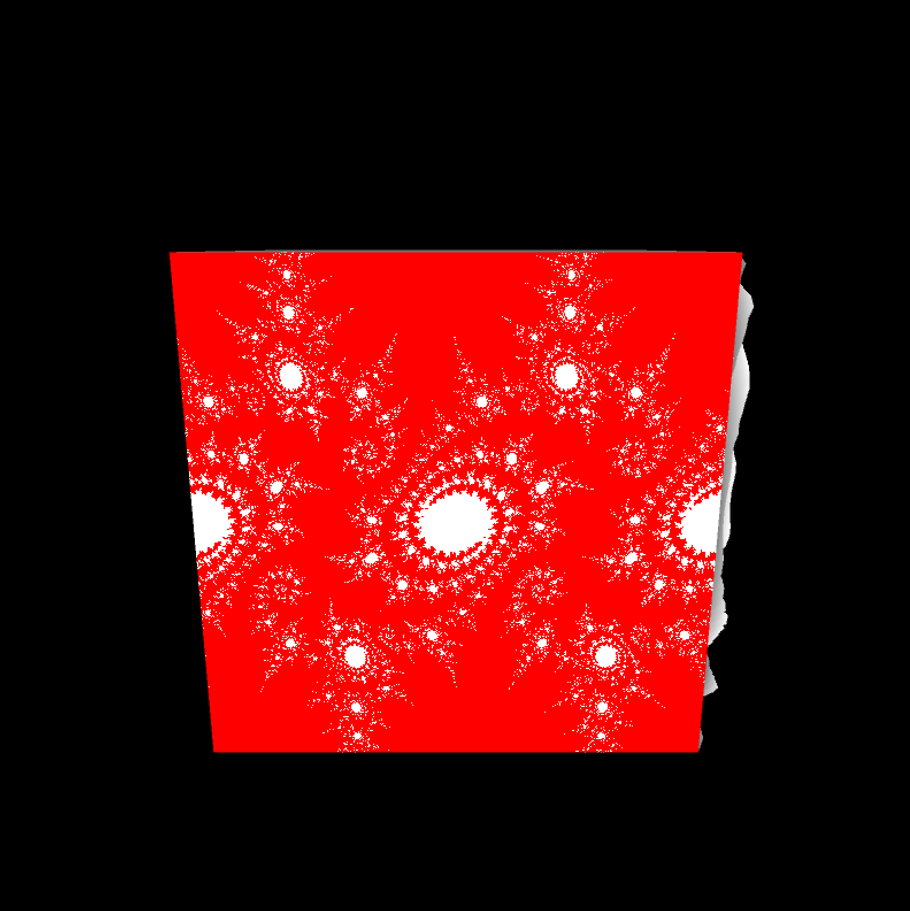
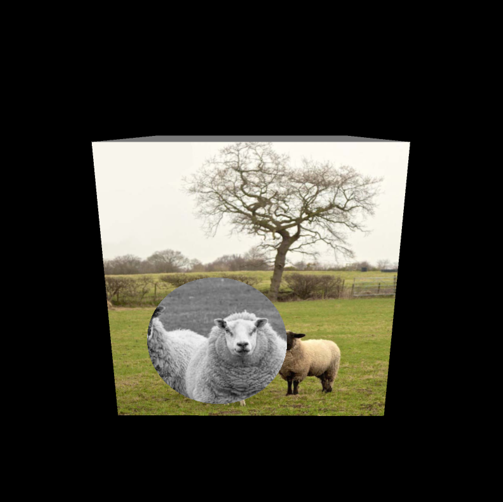
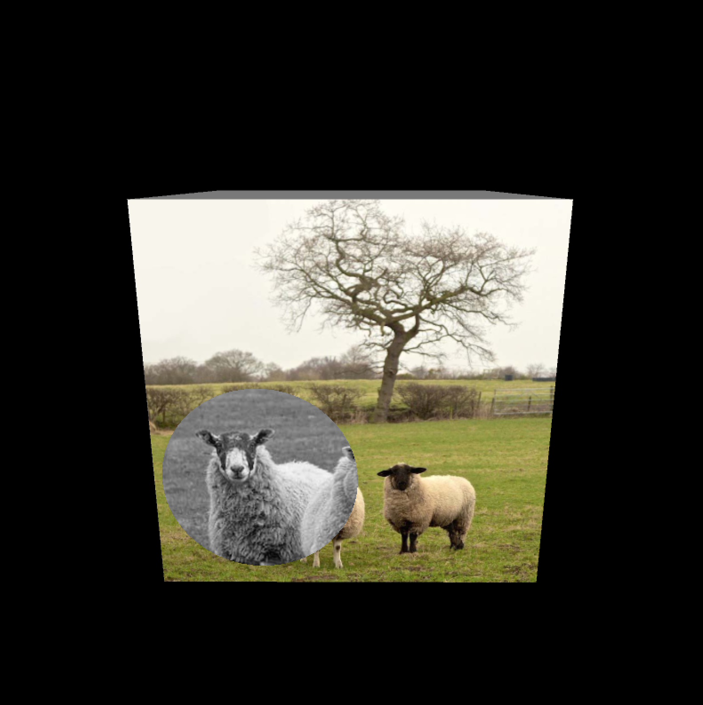
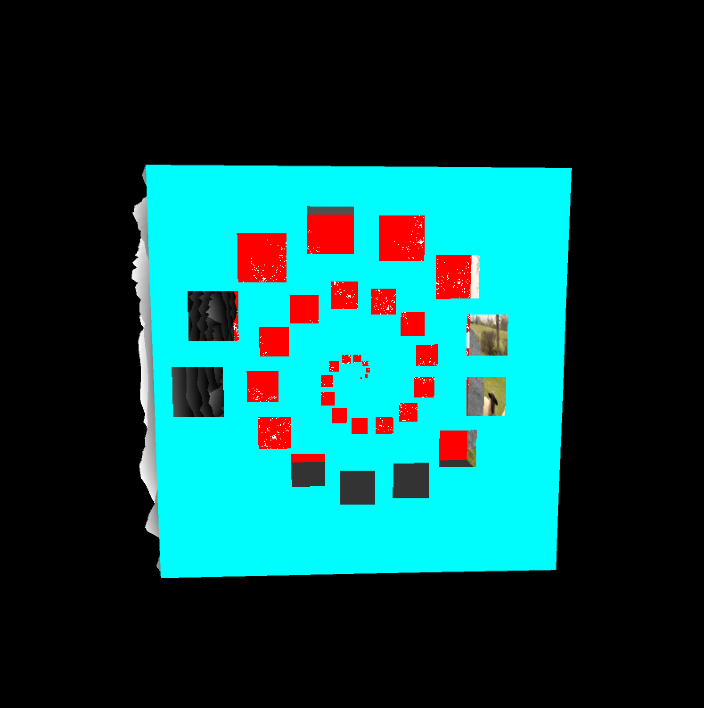

# GPU Rendering Assignment

## Overview

The purpose of this assignment is to leverage the GPU (vertex and fragment processors) to perform various rendering tasks. You will write three fragment programs to create different patterns and textures, as well as one vertex program to modify the geometry of a simple surface.

---

## Demo

|  |  |  |
| ---------------------- | ---------------------- | ---------------------- |
|  |  |  |
|  |  |  |

---

## Tasks

### 1. Spiral of Squares

Your first task is to modify a translucent blue polygon to display a spiral of square holes inside it. This effect is achieved by adjusting the alpha value per fragment using a fragment shader.

- Create square holes arranged in a spiral pattern around a center point.
- Each square's angle is the previous square's angle plus a constant.
- The width of each square increases with its angle.
- The distance of each square from the center also scales with its angle.
- Requirements:
  - At least 20 squares.
  - Spiral completes at least two full rotations counter-clockwise.
  - Larger squares as they spiral outward.
  - Avoid partial squares that get clipped at the polygon edge.

---

### 2. Fractal Chain

create a fractal pattern based on the sine of complex numbers. Modify one of the squares from the example code to display a white fractal set against a colored background (e.g., red).

```

---

### 3. Magnifier

A magnifying glass effect on an image using fragment shaders:

- **Convert color to grayscale:**
Calculate the grayscale value of each fragment by averaging the red, green, and blue components of the pixel texture.

- **Moving grayscale circle:**
Display a moving circle on the image that only shows the grayscale version of the pixels inside the circle.

- **Magnification effect:**
Modify the contents of the grayscale circle to show a magnified portion of the image. The pixels displayed inside the circle should come from a smaller region (half the diameter of the full circle), centered on the circle’s center.

- **Implementation notes:**
- The rest of the image remains in full color.
- The magnifying circle moves over the image dynamically.
- Use texture coordinates to sample pixels correctly for magnification.

---

### 4. Waves (Vertex Shader)

Modifying the geometry of a quad to create a sinusoidal wave pattern via a vertex shader:

- **Subdivide quad:**
Modify the Java code (`p4_code.pde`) to subdivide the original quad into a grid of at least 40x40 smaller quads (planar, equal area).

- **Vertex displacement:**
In the vertex shader, displace each vertex along its normal vector according to a sinusoidal function based on its distance from the center of the quad.

- **Distance calculation:**
The center of the quad corresponds to texture coordinates \( (s, t) = (0.5, 0.5) \). Use these to compute vertex distance from center.

- **Edge damping:**
To prevent cracks at the edges (where the waving quad meets other cube faces), gradually reduce the wave amplitude near the edges.

- **Color mapping:**
The geometry’s color should reflect the wave height:

- Peaks are white.
- Lower regions are black.

- **Shader communication:**
Pass an "offset" parameter from the vertex shader to the fragment shader to control color based on vertex displacement. This parameter is already defined in the shaders — you just need to implement it.

- **Important:**
All vertex movement must be done in the vertex shader, not in the Java code. The Java code only handles subdivision and initial vertex positions.

---
```
