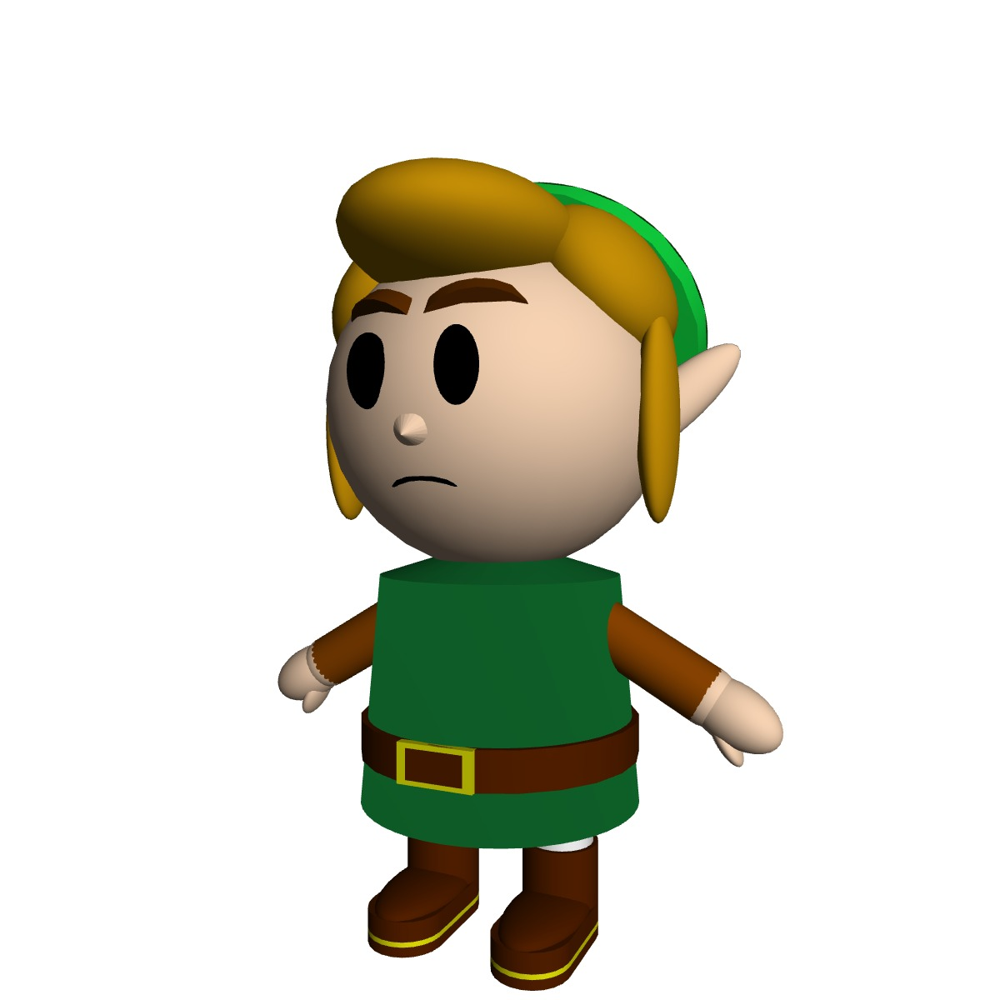

# 3D Character Rendering in p5.js

This project showcases a 3D-rendered character composed of simple geometric shapes using the p5.js library with the WEBGL renderer. The character is loosely inspired by **Link** from _The Legend of Zelda_ and demonstrates how basic forms like boxes, spheres, cones, toruses, and cylinders can be combined to create a complex figure.

The character spins continuously in 3D space with lighting and perspective applied for visual depth and realism.
