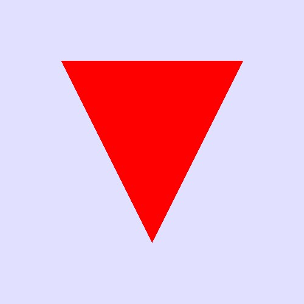
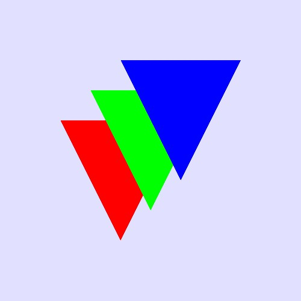
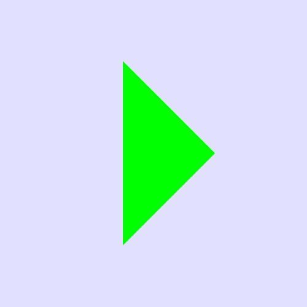
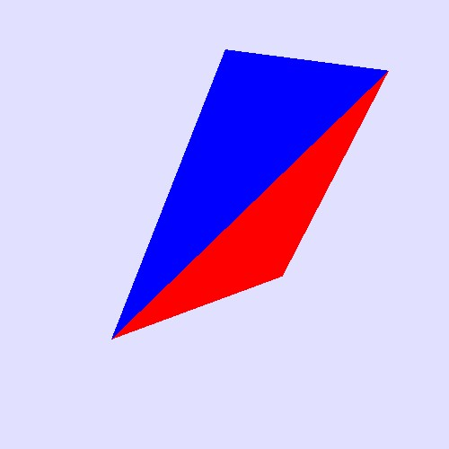
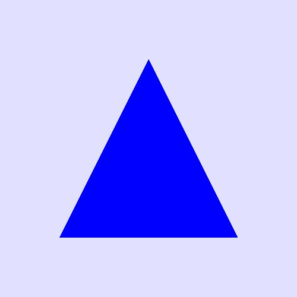
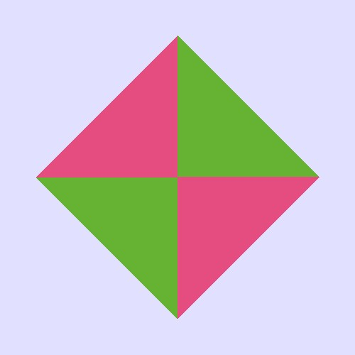
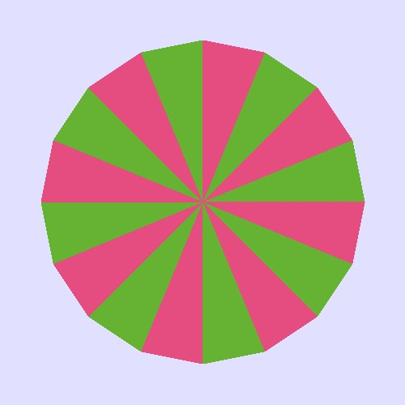
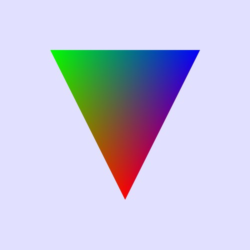
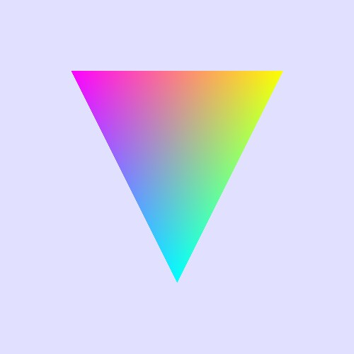

# Triangle Rasterization with Color Interpolation

## Overview

This project implements triangle rasterization using the **incremental scanline approach**, forming the foundation for a 3D triangle rendering system. In this stage (Part A), the system rasterizes triangles and performs **per-vertex color interpolation** across the surface of each triangle. In Part B, the system will be extended to include **lighting**, **shading**, and **z-buffering** for hidden surface removal.

---

## Objective

- Rasterize triangles using the **incremental scanline method**.
- Interpolate **per-vertex RGB colors** across the triangle face.
- Build core functionality for a 3D rendering pipeline.

---

## API Description

These are the core functions:

### `Begin_Shape()`

- Signals the start of a new triangle definition.
- Typically initializes internal state, such as resetting a vertex list or counter.

### `Vertex(x, y, z)`

- Defines a single vertex of the triangle using its **(x, y, z)** coordinates.
- Must be called **exactly three times** between `Begin_Shape()` and `End_Shape()`.
- Each vertex receives the color set by the most recent `Set_Color()` call.

### `End_Shape()`

- Signals that all three vertices of a triangle have been defined.
- Triggers the **rasterization** of the triangle using the scanline algorithm.
- Performs **color interpolation** across the triangle surface.

### `Set_Color(r, g, b)`

- Sets the current drawing color using floating-point RGB values in the range **[0.0, 1.0]**.
- Affects the color assigned to all subsequent vertices defined via `Vertex()`.

---

## Example Usage

```cpp
Set_Color(1.0, 0.0, 0.0); // Red
Begin_Shape();
Vertex(100, 100, 0.0);

Set_Color(0.0, 1.0, 0.0); // Green
Vertex(150, 200, 0.0);

Set_Color(0.0, 0.0, 1.0); // Blue
Vertex(50, 200, 0.0);
End_Shape();
```

## Output

|  |  |  |
| ----------------------- | ----------------------- | ----------------------- |
|  |  |  |
|  |  |  |
